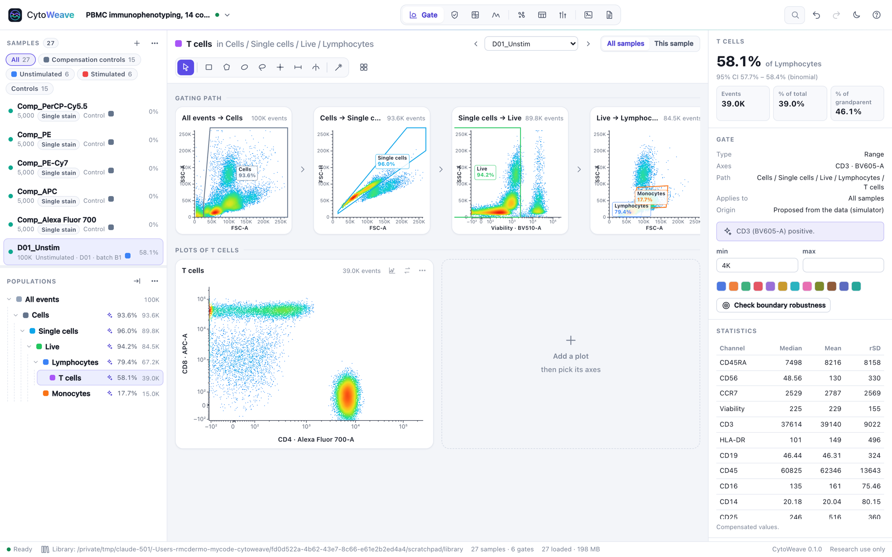
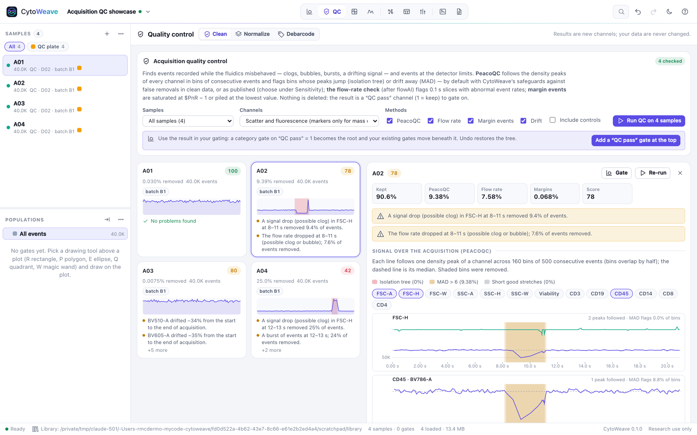
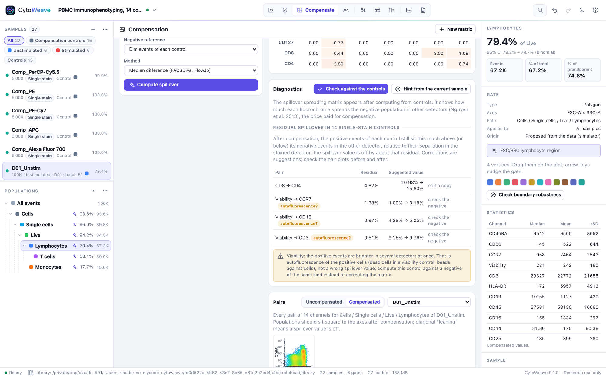
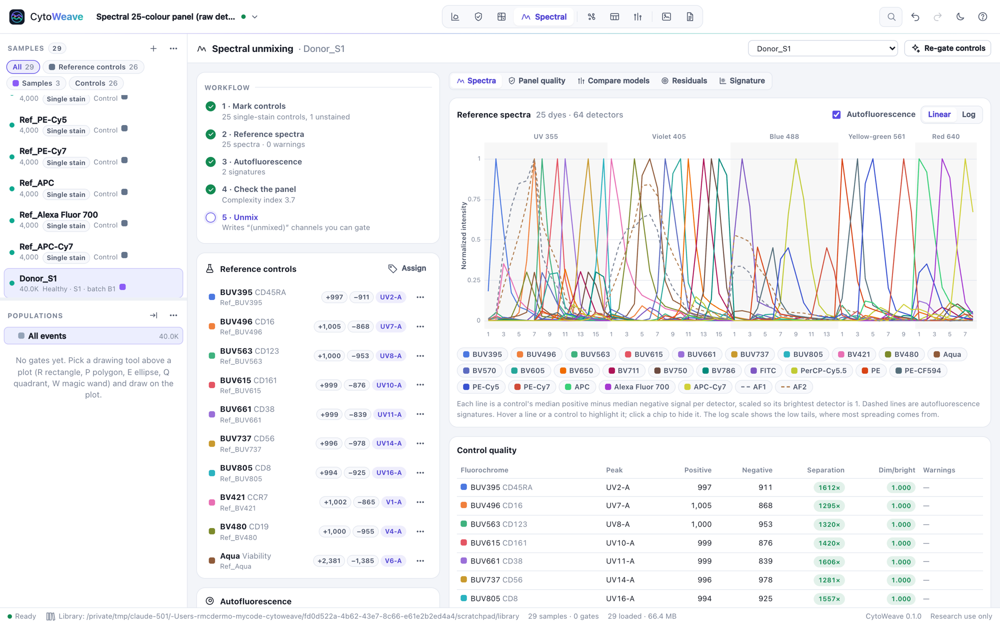
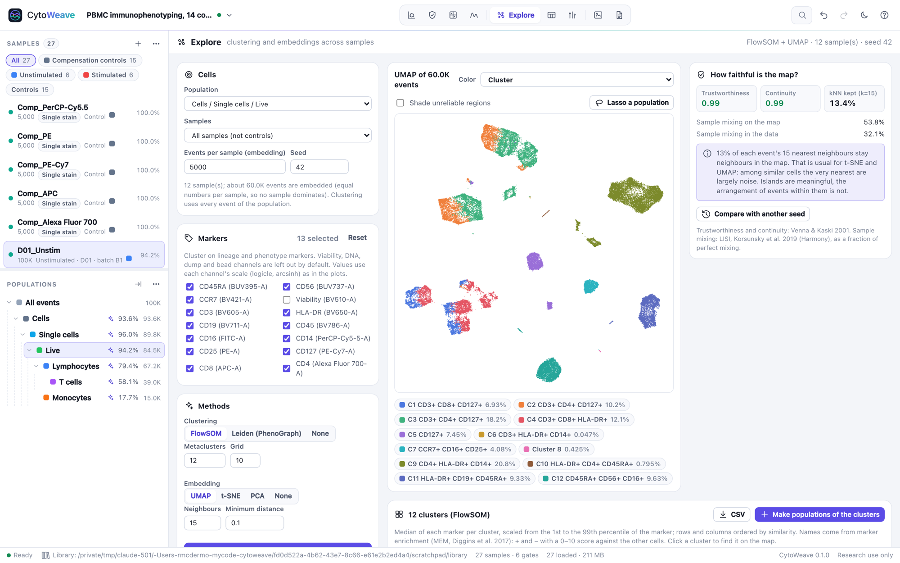
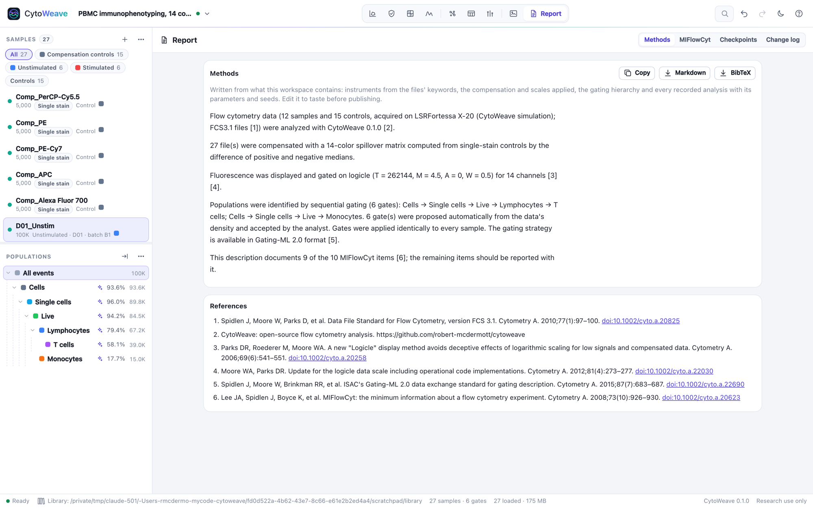

# CytoWeave



CytoWeave is a flow cytometry analysis workbench for conventional, spectral
and mass cytometry. It runs on your own computer as one self-contained
program: a single command installs it, and it needs no licence server,
account, Python, R or plugins. Files are read and analyzed in your browser
and never leave your machine.

It covers the analysis loop a cytometry lab works through every day, and
checks each step:

- gating many samples consistently, with per-sample adjustments;
- spillover from single-stain controls, checked against those controls;
- spectral unmixing with autofluorescence, and a comparison of how the choice
  of unmixing model changes the result;
- acquisition QC that finds clogs and bubbles and leaves clean data alone;
- batch normalization and debarcoding;
- clustering and UMAP/t-SNE maps that report how far they can be trusted;
- statistics tables and group comparisons with the right test for the design;
- cell-cycle and proliferation models;
- publication figures, a methods paragraph with references, and a MIFlowCyt
  checklist.

It reads FlowJo workspaces and Gating-ML, and reproduces FlowJo's scales
exactly.

CytoWeave is free and open source (Apache 2.0).

- [Highlights](#highlights)
- [Install](#install)
- [Getting started](#getting-started)
- [Opening data](#opening-data)
- [The views](#the-views)
- [Workspaces, history and the library](#workspaces-history-and-the-library)
- [Working with FlowJo and other tools](#working-with-flowjo-and-other-tools)
- [Command-line options](#command-line-options)
- [Scripting and AI agents](#scripting-and-ai-agents)
- [Validation](#validation)
- [Privacy and security](#privacy-and-security)
- [Limitations](#limitations)
- [Development](#development)
- [License, citation and credits](#license-citation-and-credits)

## Highlights

- **Gating.**
  - Rectangle, polygon, freehand, ellipse, quadrant, range and split gates,
    with keyboard shortcuts.
  - A magic wand that gates a density basin on a 2-D plot, or splits a
    histogram at its valley.
  - Pseudocolor, dot, density, contour, zebra, histogram and cumulative plots.
  - Backgating, overlays of other samples, and the gating path of any
    population as a row of plots.
  - Gates are shared by every sample. Adjusting one for a single sample makes
    a visible override, not a copy.
- **Scales that match.** Logicle (Moore & Parks reference implementation),
  arcsinh, log, linear and FlowJo's biexponential. The biexponential is
  reproduced exactly from FlowJo's own table algorithm, and checked against
  BD's published lookup tables.
- **Compensation.**
  - Compute spillover from single-stain controls, by median difference or
    robust regression.
  - Edit a matrix with undo, check it in N×N pair plots, and see the
    spillover spreading matrix.
  - **Check a matrix against its controls.** The check finds a wrong value
    and suggests the correction. It recognizes when a control's positives are
    simply more autofluorescent (dead cells, beads) rather than
    miscompensated.
- **Spectral unmixing.**
  - Reference spectra from single-stain controls, gated automatically.
  - Several autofluorescence signatures extracted from the unstained control.
  - Least-squares, weighted (fixed or per event) and non-negative unmixing,
    with per-event autofluorescence.
  - Panel complexity index, similarity and spreading matrices, a residual
    check, and a side-by-side **comparison of unmixing models** on your own
    sample.
- **Acquisition QC.**
  - PeacoQC, with CytoWeave's refinements that stop it removing events from
    clean or slowly drifting files.
  - A flow-rate check, margin events, and signal drift reported per channel.
  - A 0–100 score per sample and a cohort overview.
  - The result is a "QC pass" channel to gate on. Your data are never
    changed.
- **Batch effects.**
  - CytoNorm normalization against reference samples, with a confounding
    check and before/after distances.
  - Bead normalization for mass cytometry, and debarcoding.
- **Clustering and maps.**
  - FlowSOM and Leiden (PhenoGraph) clustering, and UMAP, t-SNE and PCA
    across samples.
  - Clusters are named from their marker enrichment and can become gateable
    populations.
  - Every map reports **how faithful it is**: trustworthiness, continuity,
    neighbourhood preservation, sample mixing, seed stability, and shading
    of unreliable regions.
- **Tables and statistics.**
  - Counts, frequencies (with 95% confidence intervals), medians, means,
    geometric means, CVs, robust SDs, percentiles and more, for every sample.
  - Group comparisons choose the test from the design: two groups, paired,
    several groups, repeated measures. Each comes with a nonparametric
    counterpart, effect sizes, confidence intervals and multiple-testing
    correction.
  - Screens of every population or cluster, with volcano plots and
    differential abundance.
- **Review across samples.**
  - Every sample's result for a gate, ranked by how unusual it is: frequency
    outliers, boundaries drawn through dense regions, low counts.
  - **Boundary robustness** shows how much a frequency depends on exactly
    where a gate was drawn.
- **Figures and reports.**
  - Gating-strategy and across-samples figures that stay live until you
    export them, as SVG, PNG or PDF.
  - A methods paragraph with numbered references, written from what the
    workspace actually did, and a MIFlowCyt checklist.
  - Checkpoints, with a plain-language diff of what changed between two
    versions of an analysis and how it moved every frequency.
- **Interchange.**
  - FlowJo workspaces (.wsp), imported with a report of exactly what was
    reproduced, plus a population-by-population count comparison.
  - Gating-ML 2.0 in and out, and classification results (CLR).
  - Archival Cytometry Standard containers that bundle the workspace with its
    FCS files.
  - FCS 2.0 to 3.2.
- **Nine example experiments** generated by a physical simulator, each with
  the ground truth for every event: immunophenotyping with a deliberate
  compensation error, a FlowJo workspace to migrate, a 25-colour spectral
  panel, cell cycle, proliferation, a two-batch mass cytometry cohort, a
  barcoded plate, an index sort and a QC plate.
- **Scripting and agents.** An MCP server lets AI agents such as Claude Code
  open data, gate, compute statistics, review gates and write methods in the
  window you are watching. Every change can be undone.
- **Validated.** A validation suite checks the pipelines against known
  answers and published reference values on every change; see
  [validation/](validation/README.md).

## Install

### macOS and Linux

```sh
curl --proto '=https' --tlsv1.2 -fsSL \
  https://raw.githubusercontent.com/robert-mcdermott/cytoweave/main/install.sh | sh
```

This installs the latest release as `$HOME/.local/bin/cytoweave`. It checks the
download's SHA-256 checksum and version, and replaces an existing copy only
after both checks pass. It does not use `sudo` or change `PATH`; if
`~/.local/bin` is not on your `PATH`, it prints the full path to run.

### Windows

Run in PowerShell:

```powershell
irm https://raw.githubusercontent.com/robert-mcdermott/cytoweave/main/install.ps1 | iex
```

This installs to `%LocalAppData%\Programs\CytoWeave`, checks the checksum and
version, and adds that folder to your user `PATH`. It needs neither
administrator rights nor a change to the execution policy. Open a new terminal
afterwards.

To pin a version, download and verify the files yourself, upgrade or
uninstall, see [Installing CytoWeave](docs/INSTALLING.md).

### Start

```sh
cytoweave
```

CytoWeave starts a local server and opens its window. If Chrome, Edge, Brave
or Chromium is installed, the window is a desktop app window; otherwise the
default browser is used. Closing the window stops the program.

Files and folders named on the command line open directly:

```sh
cytoweave ~/data/2026-09-30_panel1/
```

Running `cytoweave <files>` again while it is open hands the files to the
open window.

CytoWeave is developed and tested in Chrome, Edge and Brave. It uses only
standard web features (module workers, canvas, IndexedDB and the
origin-private file system), so current Firefox and Safari should work when
you open the printed address in them, but they are not tested regularly.

## Getting started

The quickest way to see what CytoWeave does is an example experiment. On the
start page, or with **Workspace → Example experiments…**, open one:

| Example | What it shows |
| --- | --- |
| PBMC immunophenotyping, 14 colours | Six donors, unstimulated and stimulated, with a full set of compensation controls. The file's spillover matrix has one wrong value for the compensation check to find, and one sample has a clog for QC to find. |
| Moving from FlowJo | Four PBMC samples with the FlowJo 10 workspace made for them. It opens in the FlowJo import dialog; the migration report then compares every population count with FlowJo's. |
| Spectral 25-colour panel | Raw data from 64 detectors, 25 single-stain references and an unstained control with lymphoid and myeloid autofluorescence. |
| Cell cycle | Propidium iodide DNA content of an asynchronous and a nocodazole-arrested culture, with doublets and debris. |
| T-cell proliferation | CellTrace Violet dilution over four days, with and without stimulation, and a day-0 reference. |
| Mass cytometry cohort | Eight subjects in two batches with anchor samples, EQ beads and signal drift; non-classical monocytes are doubled in the case group. |
| Barcoded mass cytometry plate | Twenty samples pooled into one file with palladium barcodes and the barcode key. Debarcode it, split it into one sample per well, and compare stimulated with unstimulated wells. |
| Index sort | A presort and the index-sorted events of a 96-well plate. |
| Acquisition QC showcase | Four wells: clean, a clog, gradual drift and an air bubble. |

Every example is generated in the browser by a simulator that models
instruments, fluorochrome spectra, spillover, autofluorescence, cell
populations, dead cells, debris, doublets and acquisition problems. It keeps
the true identity of every event. After opening an example you can:
- add its suggested gates;
- colour plots by the "Truth (simulated)" channel;
- compare your answers with the truth.

With your own data, add FCS files or a folder (each folder becomes a sample
group), then:

1. **Annotate** the samples (**Annotate selection…** in the sample list):
   condition, subject, batch, timepoint and so on. **Suggest from file names**
   fills these from the parts of the file names that vary.
2. **Mark the controls** (unstained, single stain, FMO, beads) and check the
   compensation in the **Compensate** view.
3. **Gate** in the **Gate** view. Gates apply to every sample. Press ↑ and ↓
   to step through the samples, and switch the scope to **This sample** to
   adjust a gate for one sample only.
4. Run **QC**, then **Explore**, **Tables** and **Compare** as your question
   needs.
5. Build **Figures** and copy the **Report**'s methods paragraph.

Press ⌘K (Ctrl+K) to search samples, populations, channels and commands, and
**?** for every keyboard shortcut.

## Opening data

| File | Opens as |
| --- | --- |
| `.fcs`, `.lmd` | Samples. FCS 2.0, 3.0, 3.1 and 3.2; integer, float, double and ASCII data; files with several data sets become one sample each |
| A folder | Its FCS files, as a sample group |
| `.cwz` | A CytoWeave workspace |
| `.acs`, `.zip` | An Archival Cytometry Standard container: a workspace with its FCS files |
| `.wsp` | A FlowJo 10 workspace (see [below](#working-with-flowjo-and-other-tools)) |
| `.xml` | Gating-ML 2.0 gates and compensation |
| `.csv`, `.tsv` | Sample annotations: the first column names the sample or file, the other columns become fields |

Drag files onto the window, use the **+** button of the sample list, or name
them on the command line.

FCS files from real instruments often bend the standard, and CytoWeave reads
them anyway. Every repair it makes is listed in the sample's diagnostics in
the inspector:
- text that is neither UTF-8 nor Latin-1;
- offsets that disagree or are off by one;
- truncated data or a missing event count;
- log-amplified integer data.

Spillover is read from `$SPILLOVER`, `SPILL`, `$SPILL` or `$COMP`.

## The views

### Gate

The workbench above.
- **Left:** the samples and the population tree.
- **Middle:** the gating path of the selected population and its plots.
- **Right:** the population's frequency with a 95% confidence interval, the
  gate's exact geometry (editable as numbers), statistics per channel, and
  the sample's keywords.

Gates are drawn with the toolbar or the keyboard:

| Key | Tool |
| --- | --- |
| V | Select and edit |
| R, P, E, L | Rectangle, polygon, ellipse, freehand |
| Q, H, S | Quadrant (four gates), range, split (two gates) |
| W | Magic wand: the density basin under the cursor, or a histogram's valley |
| B | Backgate the selected population on its ancestors |

A tool is used for one gate. Hold ⇧ with its key, or double-click it, to keep
it for several. New gates get a suggested name ("Singlets", "Live",
"CD4+ CD8−") that you can accept or type over.

The plot menu covers:
- export as SVG, PNG or to the clipboard;
- overlays of other samples, and the axis scales;
- adding a plot to a figure;
- the colour map and dot size.

The **Edit axis scales** dialog sets a channel's scale for every plot, with a
live histogram preview. It can estimate the logicle width from the data.

Right-click a population for more:
- **Review across samples** ranks every sample's result for this gate;
- **Copy to another population**, and **Applies to** limits a gate to a
  sample group;
- export of the population's events as FCS (raw values and the original
  keywords) or CSV;
- the **cell cycle** and **proliferation** models.

The **cell cycle** model fits Dean–Jett–Fox or Watson to the DNA content and
suggests a singlet gate. The **proliferation** model fits generations of dye
dilution and reports the division, proliferation, expansion and replication
indices.

### QC



**Clean** runs acquisition QC on any set of samples:
- PeacoQC on every scatter and fluorescence channel;
- a flow-rate check (generalized ESD on events per 0.1 s);
- margin events at the detector limits;
- per-channel drift.

Each sample gets a score, plain-language findings and plots of its signal and
event rate over time. **Add a "QC pass" gate at the top** puts the result
under the whole gating tree; undo restores it.

The default **refined** PeacoQC requires a flagged stretch to stand out from
the signal's own trend by more than its noise and by at least 1.5% of the
axis, and requires isolation-tree splits to be contiguous in time. As
published, PeacoQC removes events from clean files and cuts the ends of
drifting ones; the refined variant does neither, and still catches clogs and
bubbles. The validation suite measures both. The classic algorithm is one
click away under **Sensitivity**, where both results can be compared.

**Normalize** trains CytoNorm on reference samples, one per batch, and
applies it. It first checks that batch and condition are not confounded. It
can model the whole population or each cluster of a clustering channel, and
reports each batch's distance to the pooled distribution before and after.
For mass cytometry, **bead normalization** corrects signal drift with EQ
beads.

**Debarcode** assigns barcoded events by their k positive channels, with a
draggable separation cutoff and a yield plot. **Split into samples** then
writes each code's events as a sample of its own, named after the code, so
the wells of a pooled plate can be annotated and compared. A key can name the
codes after the samples they hold.

### Compensate



- **Compute from controls.** Pick each control's stained channel, the events
  to use and the negative reference (each control's dim events, or an
  unstained sample). Choose the median difference (as FACSDiva and FlowJo do)
  or robust regression (AutoSpill-style).
- **Edit.** Edit a matrix as percentages, with the mouse wheel or by typing,
  and apply it to all samples, a group or a selection. Its condition number
  shows how much it amplifies noise.
- **Check against the controls.** Compensates each single-stain control with
  the matrix and measures what its positive events still leave in every
  other detector. A residual means the spillover value is off by about that
  much; the check suggests the corrected value.
  - A matrix you made can be corrected in place. One from a file is
    corrected in a copy that its samples then use, in one undoable step.
  - When a control's positives are brighter in several detectors at once,
    the check reports autofluorescence (dead cells in a viability control,
    beads against cells) instead of offering a "correction".
- **Diagnose.** The spillover spreading matrix (Nguyen et al. 2013) shows
  which detectors lose resolution, and N×N pair plots show any population
  that still leans.

### Spectral



For raw data from spectral cytometers (Cytek Aurora and Northern Lights, Sony
ID7000, BD FACSDiscover and others), a five-step workflow:
1. **Mark controls.** Mark the single-stain references and the unstained
   control.
2. **Reference spectra.** Gate all controls automatically. Each control's
   positive and negative events are found without scatter gates, and its
   spectrum is the difference of their medians.
3. **Autofluorescence.** Extract one or more autofluorescence signatures from
   the unstained control.
4. **Check the panel.** See the complexity index, the most similar pair of
   spectra, the similarity matrix and the spreading matrix.
5. **Unmix.** Choose a method: ordinary, weighted (fixed or per-event
   weights) or non-negative least squares. Autofluorescence can be left out,
   treated as one signature, or assigned per event. Unmixed channels become
   ordinary channels to gate on, and the residual of every event is a
   channel too.

**Compare models** unmixes one population of your sample with seven
combinations of method and autofluorescence model. For every dye it shows the
spread of the negative population and the signal left unexplained, so you can
see which choice resolves your dim populations best. **Residuals** shows where
the reference set fails to explain the data, for example a missing dye or a
degraded tandem.

### Explore



Pick a population, the samples (an equal number of events from each) and the
markers. Then run:
- **FlowSOM** or **Leiden** (PhenoGraph) clustering on every event of the
  population;
- **UMAP**, **t-SNE** or **PCA** on the sampled events.

Clusters are named from their marker enrichment (MEM). The heatmap shows each
cluster's median of every marker. **Make populations of the clusters** turns
them into gates. A cluster's frequency per sample goes straight to
**Compare**. You can colour the map by cluster, density, sample, any
annotation or any marker, and lasso a region to make it a population.

**How faithful is the map?** answers what most tools leave to faith:
- **Trustworthiness and continuity** (Venna & Kaski): are map neighbours true
  neighbours, and do true neighbours stay together?
- **Neighbourhood preservation**: the share of exact nearest neighbours kept.
- **Sample mixing on the map versus in the data** (LISI): whether the map
  separates samples more than the data do.
- **Seed stability**, against a second run with another seed.
- **Shading of unreliable regions**: events whose map neighbours come from
  elsewhere in the data.

Each result comes with a plain-language reading.

### Tables

Batch statistics: one row per sample, one column per statistic. The
statistics are:
- count, % of parent, % of grandparent, % of total, % of any ancestor;
- concentration (/µL, from `$VOL`);
- median, mean, geometric mean, SD, robust SD, CV, robust CV, median
  absolute deviation;
- minimum, maximum, percentile, mode, and % above a threshold.

**Table of every population** builds the usual frequency table in one click.
Tables can be shown as a heat map, copied as TSV or saved as CSV. Any column
can be compared between groups.

### Compare

Compare one measure between groups of samples:
- a population statistic;
- a table column;
- a cluster's abundance.

Group by any annotation, or by workspace groups. Paired designs are detected
from a subject field.

The **automatic** test follows the design, and each test is reported with a
nonparametric counterpart:

| Design | Test | Counterpart |
| --- | --- | --- |
| Two groups | Welch's t-test | Mann–Whitney U |
| Paired | Paired t-test | Wilcoxon signed-rank |
| Several groups | Welch's ANOVA | Kruskal–Wallis |
| Repeated measures | Repeated-measures ANOVA | Friedman |

Several groups are followed by Holm-adjusted comparisons with the reference.
Results show:
- effect sizes: differences and ratios of means, Hedges' g, the
  Hodges–Lehmann shift;
- 95% bootstrap confidence intervals;
- a note on assumptions.

**Screen populations** and **Screen clusters** test every population or
cluster at once. Results are corrected for multiple testing
(Benjamini–Hochberg, Benjamini–Yekutieli, Holm or Bonferroni) and shown on a
volcano plot. Cluster abundance uses a quasi-binomial model in the manner of
diffcyt. Clicking a point opens that sample.

### Figures

Page layouts for publication: the gating strategy of a population in one
click, a grid of the current plots across samples, or a blank page with
plots, text and arrows. Plots stay live, following gate and compensation
changes, until you export the page as SVG, PNG or a 300 dpi PDF. Pages come
in slide (16:9), Letter, A4, landscape and square sizes.

### Report



- **Methods.** A paragraph written from what the workspace contains, with
  numbered references and DOIs:
  - the instrument and files;
  - the compensation and where it came from;
  - the scales;
  - the gating hierarchy;
  - every algorithm with its parameters and seed;
  - the statistical comparisons.

  Copy it, or download it as Markdown with a BibTeX file of the references.
- **MIFlowCyt.** A checklist of the minimum information for a flow
  experiment, showing what the workspace documents and what is missing.
- **Checkpoints.** Save the state of an analysis and later compare it with
  the current one. The comparison lists what changed in words, such as "the
  Live gate moved by 3% of the axis" or "the compensation of 12 samples
  changed", and shows the effect on every population's frequency. Restore a
  checkpoint with one click.
- **Change log.** Every recorded action, downloadable as JSON.

## Workspaces, history and the library

A workspace holds:
- the samples and their annotations;
- gates, matrices and scales;
- derived results: clusters, maps, unmixed channels and QC masks;
- figures, tables and the change log.

Every edit can be undone (⌘Z) and redone (⇧⌘Z).

Workspaces save themselves to the **library**, a folder in your user
configuration directory: `~/Library/Application Support/CytoWeave` on macOS,
`~/.config/CytoWeave` on Linux, `%AppData%\CytoWeave` on Windows. The
library keeps each FCS file once, under its SHA-256 checksum. A workspace
refers to files by checksum, so it keeps working when the original files are
moved or renamed. Deleted workspaces go to the library's `trash` folder.

**Workspace → Export** writes:
- a workspace file (`.cwz`);
- an ACS container with the FCS files, to send to a colleague or archive with
  a paper;
- the gates as Gating-ML;
- population memberships as CLR.

## Working with FlowJo and other tools

**FlowJo workspaces** (FlowJo 10 `.wsp`) import their samples, gates,
compensation matrices and scales. The import dialog lists every population as
exact, approximated or unsupported, and says why. For example:
- an ellipse drawn on transformed axes;
- a curly quadrant;
- a gate on uncompensated data.

Add the FCS files and CytoWeave matches them. With **Compare every population
count with FlowJo's**, the **FlowJo migration report** shows FlowJo's count,
CytoWeave's count, the difference and the likely cause, population by
population.

FlowJo's biexponential scale is reproduced exactly, from FlowJo's own table
algorithm. FlowJo's logicle departs from the reference logicle that
CytoWeave and Gating-ML use at widths above 0.5, so polygon edges on such
axes are reported as approximated.

**Gating-ML 2.0** import and export covers:
- rectangle, polygon, ellipsoid, quadrant and Boolean gates;
- the flin, flog, fasinh, logicle, hyperlog and ratio transformations;
- spectrum matrices.

Re-importing a CytoWeave export restores names, colours and scales exactly.
Gating-ML has no biexponential, so biexponential axes are written as their
closest logicle, with the gate coordinates converted; the export warns when it
does this.

**CLR** (classification results) exports a column per population or cluster
for every event, for tools that read memberships.

## Command-line options

```text
cytoweave [flags] [FCS files, folders, workspaces (.cwz), Gating-ML or FlowJo .wsp files...]
cytoweave mcp [flags]
```

| Flag | Default | Effect |
| --- | --- | --- |
| `--window app\|browser\|none` | `app` | Open an app window (Chrome, Edge, Brave or Chromium, with its own profile), the default browser, or nothing |
| `--no-open` | | Same as `--window none` |
| `--keep-running` | | Keep serving after the window is closed |
| `--port` | `8770` | Preferred port; the next free one is used if it is taken |
| `--host` | `127.0.0.1` | Interface to bind. Keep the default unless you mean to serve other machines (for example `0.0.0.0` on a trusted network), which turns off the DNS-rebinding check |
| `--data-dir` | user config dir | Folder of the workspace library |
| `--no-library` | | Keep workspaces in the browser's own storage instead |
| `--remote-control` | | Accept actions from local programs (see below) |
| `--dev` | | Serve `web/` from the working directory (for development) |
| `--version` | | Print the version |

## Scripting and AI agents

`cytoweave mcp` is a [Model Context Protocol](https://modelcontextprotocol.io)
server. With it, an AI agent such as Claude Code can drive the CytoWeave
window you are watching:
- open files and examples, and inspect the gating tree;
- create gates from coordinates or propose them from the data's density;
- edit gates, compute statistics across samples and render plots;
- review a gate across the cohort, compare groups, write the methods, and
  export Gating-ML.

```sh
claude mcp add cytoweave -- ~/.local/bin/cytoweave mcp
```

> Open the PBMC example, gate cells, singlets, live cells and CD3+ T cells,
> then CD4 and CD8 T cells, and tell me how the CD4:CD8 ratio differs between
> stimulated and unstimulated samples.

The agent works through the same actions as you do. Its gates are marked as
added by an agent, every change appears in the change log, and any of it can
be undone. See [Using CytoWeave with AI agents](docs/MCP.md) for the 15 tools,
other clients and how it works.

The same actions are available to your own programs (Python, Jupyter, shell
scripts) with `--remote-control`; [docs/MCP.md](docs/MCP.md#scripts-without-an-agent)
shows how.

## Validation

The unit tests check every analysis function against hand-computed,
published or reference-tool values. The validation suite runs the complete
pipelines, as the app does, against answers known in advance:

| Area | Checked against | Result |
| --- | --- | --- |
| FCS | All 82 example files | Parsed without warnings; written and read back bit-exact |
| Compensation | The true spillover of the PBMC example | Matrices within 0.02 of the truth; the planted error found first, corrected to 0.158 (true 0.157) |
| Gating | True cell types | Precision 91–100%, recall 96–100% |
| QC | Known clogs, bubbles and drift | 99.8–100% of anomalous events removed; ≤ 1.4% of clean events, none from clean or drifting files |
| Spectral | True abundances of 25 fluorochromes | Median r = 0.988; within 0.001 of unmixing with the true spectra |
| Cell cycle | True phase fractions | Dean–Jett–Fox within 1.6 points, Watson within 2 |
| Proliferation | True precursor frequencies | Division index within 3% |
| Debarcoding | True wells of a 20-sample barcoded plate | 100% of assigned cells in their true well; 98.7% of cells assigned |
| Clustering | 23 true populations | FlowSOM adjusted Rand index 0.91 |
| Normalization | Same-donor anchors in two batches | Batch distance reduced 27× |
| Scales | BD's FlowJo lookup tables | Biexponential within 5e-6 (the tables' precision) |
| Statistics | R 4.x | t-tests, Wilcoxon, Benjamini–Hochberg and t quantiles agree |

Details, tolerances and how to run it are in
[validation/README.md](validation/README.md).

## Privacy and security

- Files are parsed and analyzed in the browser. Nothing is uploaded, and
  CytoWeave makes no network requests of its own.
- By default the server listens only on the loopback interface. It rejects
  requests whose `Host` header is not a local address, which blocks DNS
  rebinding. It accepts API calls only from its own pages, and serves a strict
  Content Security Policy.
- Remote control is off unless `--remote-control` is given (`cytoweave mcp`
  turns it on for its own session). Actions need a per-session token for
  anything that reads files from disk.

CytoWeave is research software. It is not a medical device and must not be
used for diagnosis.

## Limitations

- FlowJo 9 workspaces and FlowJo 11's `.flowjo` format are not read; export
  `.wsp` from FlowJo 10 or 11.
- Curly quadrants import with straight dividers. Template group gates import
  as per-sample copies, merged where samples agree.
- Event data in CSV are not imported, only annotations.
- Imaging flow data (CellView, Amnis) are not supported.
- Spectral unmixing needs the raw detector channels; files that hold only
  unmixed channels can be gated but not re-unmixed.
- Very large experiments are limited by browser memory: plan on about 4 bytes
  per event per parameter of every loaded sample (one million events × 30
  parameters is 120 MB). Samples load on demand.

## Development

### Requirements

- Go 1.24 or later (standard library only).
- Node.js 22 or later, for the tests and the validation suite.
- No build step: the web application is plain ES modules.

### Run from source

```sh
go run . --dev
```

`--dev` serves `web/` from disk, so a browser reload picks up changes.

### Build

```sh
go build -o cytoweave .
GOOS=windows GOARCH=amd64 go build -o cytoweave.exe .
```

Releases are built by `.github/workflows/release.yml` for macOS, Linux and
Windows on x64 and ARM64.

### Test

```sh
go test -race ./...
node --test "web/lib/*.test.mjs"
node validation/run.mjs
```

### Code layout

```text
main.go, security.go, local.go, store.go,      Go host: server, security checks, files named on
window.go, remote.go, mcp.go                   the command line, library, app window, remote
                                               control, MCP server
web/index.html, web/styles.css, web/app.js     application shell
web/ui/                                        views and components (the only code using the DOM)
web/lib/                                       analysis modules, each with a *.test.mjs
web/workers/                                   module workers for heavy work
validation/                                    end-to-end checks against known answers
cytoweave-spec/                                design, conventions, requirements, roadmap, research
docs/                                          installing, AI agents, screenshots
```

The design is described in [cytoweave-spec/design.md](cytoweave-spec/design.md),
the conventions in [cytoweave-spec/conventions.md](cytoweave-spec/conventions.md),
and the plans in [cytoweave-spec/roadmap.md](cytoweave-spec/roadmap.md).

## License, citation and credits

CytoWeave is licensed under the [Apache License 2.0](LICENSE). If you use it
in published work, please cite it (see [CITATION.cff](CITATION.cff)), together
with the methods listed in its Report view.

CytoWeave reimplements published methods. Their authors are cited in the
code and in the methods text it writes, among them:
- Logicle (Parks, Roederer & Moore);
- PeacoQC (Emmaneel et al.);
- FlowSOM (Van Gassen et al.);
- UMAP (McInnes et al.) and t-SNE (van der Maaten & Hinton);
- Leiden (Traag et al.);
- CytoNorm (Van Gassen et al.);
- the spillover spreading matrix (Nguyen et al.);
- MEM (Diggins et al.);
- MIFlowCyt, FCS and Gating-ML (ISAC).

Ported code:
- The FlowJo biexponential algorithm is ported from FlowKit (BSD-3-Clause,
  Scott White), which ported it from cytolib.
- The validation suite includes excerpts of BD's FlowJo transformation lookup
  tables (MIT licence, © 2020 Becton, Dickinson and Company; see
  `validation/data/LICENSE-BD-FlowJo-LUTs.txt`).

### Trademarks

FlowJo, FACSDiva, FACSDiscover, BD, Cytek, Aurora, Northern Lights, Sony,
ID7000, Amnis, CellView, CellTrace and the other product and company names in
CytoWeave and its documentation are trademarks of their respective owners.
They are named only to say what CytoWeave works with, such as the files and
workspaces it reads. CytoWeave is an independent open-source project. It is
not affiliated with, endorsed by or sponsored by any of them.

The example experiments are simulated. Instrument names in them (such as
"LSRFortessa-like") describe the configuration that was modelled, not data
from that instrument.
